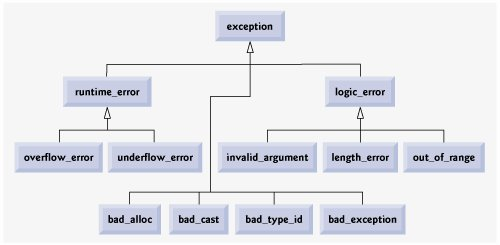

<h1 align="center">ООП - Практикум - 09.04.2025 - Седмица 08</h1>

## Static

### Статични променливи

- Третират се като глобални променливи
- Инициализират се само веднъж
- Унищожават се накрая на изпълнението на програмата

### Статични функции

- Ограничават се до 1 компилационна единица
- Еквивалент на **anonymous namespace**
- Забранява се използването им в друг файл

### extern

Нека разгледаме следната ситуация, в която имаме две променливи с еднакви имена, дефинирани в различни файлове

```c++
// A.cpp
int number = 10;
```

```c++
// B.cpp
int number = 21;
```

Ще получим грешка по време на компилация, понеже **int number** ще се дублира измежду всички компилационни единици

Ако искаме да имаме променлива или функция, която да е видима само и единствено в рамките на даден файл, можем да използваме ключовата дума **static**, която указва, че променливата / функцията ще е **"private"** само за файла, в който е дефинирана. Еквивалент на **анонимен namespace**

```c++
// A.cpp
static int number = 21; // достъпна само в рамките на A.cpp
                        // при include-ване в друг файл, се прави копие на number

namespace
{
	int number = 21; // еквивалент на: static int number = 21;
}
```

```c++
// B.cpp
int number = 10; // нямаме конфликт на имена по време на компилация
```

Статичните променливи и функции, дефинирани в даден файл, са видими само в неговата компилационна единица, като всяко **include**-ване на дадения файл прави копие на тези статични променливи и функции. Ако искаме да споделяме адреса на дадена променлива или функция измежду много файлове, можем да използваме ключовата дума **extern**, която указва, че по време на **extended linking** фазата на компилация, някъде ще съществува такава променлива / функция

```c++
// A.cpp
int number = 21;
```

```c++
// B.cpp
extern int number; // споделя адресното пространство на number от A.cpp
```

### Статични член-данни

- Не се обвързват с конкретна инстанция на класа
- Обектът, в който се намират, играе ролята на "папка", в която се "обвиват"
- Не заемат допълнително място в класа/структурата

#### Инициализират се по следния начин:

```c++
// X.h
class X
{
        static int x;
}
```

```c++
// X.cpp
int X::x = 0;
```

След **C++17** се позволява следният синтаксис

```c++
// X.h
class X
{
        inline static int x = 0;
}
```

### Статични член-функции

- Имат достъп само до статичните член-данни на обекта, понеже при тях не се добавя допълнителен параметър указател **this**
- Не могат да са **const** / **virtual**

#### Видимост при статичните член-функции

```c++
class Y
{
private:
        static int x;
        int y;
        int z;

public:
        void f();
        static void g();
}
```

- `f()` може да достъпва само `y` и `z`
- `g()` може да достъпва само `x`

#### Извикване на конструктори / деструктори при статични член-данни

```c++
struct X
{
        A a;
        static B b;
        C c;
}

void f()
{
        X x;
}

int main()
{
        f(); // A(), B(), C(), X(), ~X(), ~C(), ~A()
        f(); // A(), C(), X(), ~X(), ~C(), ~A()

        return 0;
} // ~B()
```

## Изключения

- Сигнал, че някъде в кода е възникнала грешка
- `#include <stdexcept>`

### Хвърляне на изключения

- `throw <обект>`

### Обработка на изключения

- `.what()` - съобщение на изключението

```c++
try
{
        // business logic
}
catch (const std::exception& exc)
{
        // exception handling
}
finally
{
        // further error handling
        // изпълнява се винаги, независимо дали сме влезнали catch блока
}
```

- При обработка на изключения, в **catch**-блоковете трябва изключенията да се подават по **const референция** / **референция**, зависи от това дали ще ги модифицираме, **НО НИКОГА** по копие
- При **catch**-блоковете, изключенията винаги трябва да се подреждат по конкретика, като най-конкретните са най-отгоре
- Ако първият ни **catch**-блок e `catch(...)`, то след него не можем да имаме други **catch**-блокове (получава се грешка)

```c++
try
{
        // logic
}
catch (...)
{
        // exception handling
}
catch (const std::exception& exc) // грешка
{
        // ...
}
```

### Йерархия на изключенията



- `std::bad_alloc` - грешка при заделяне на памет **new**
- `std::runtime_error` - грешка при изпълнението на програмата **nullptr check**
- `std::bad_cast` - грешка при кастване. Ако се опитаме да насочим **dynamic_cast**, който връща **nullptr**, към референция - се хвърля `std::bad_cast`
- `std::logic_error` - нарушават се инвариантите на класа

### Изключения в конструктори

- При изключение в конструктор, се извикват деструктори само на успешно създадените обекти

```c++
struct B
{
        B() { throw 7; }
}

struct X
{
        A a;
        B b;
        C c;
}

int main()
{
        X x; // A(), B(), ~A()
}
```

- При изключения в конструктор, трябва да внимаваме за незатворени външни ресурси

```c++
struct Y
{
        X obj;
        char* str1;
        char* str2;

        Y(...): obj(...)
        {
                this->str1 = new char[n];

                try
                {
                        this->str2 = new char[m];
                }
                catch (const std::bad_alloc&)
                {
                        delete[] str1;
                        throw;
                }
        }
}
```

### Изключения в деструктори

- При деструктори не хвърляме изключения, защото при 2 изключения => `std::terminate`

```c++
struct A
{
        ~A() { throw; }
}

void g()
{
        throw true;
}

void f()
{
        A obj;
        g(); // throw
} // ~A() throw

int main()
{
        f(); // 2 изключения => std::terminate
}
```

### Нива на exception safety

- **No throw guarantee**
  - `std::nothrow`
  - гарантирано е, че няма да се хвърлят изключения
 
- **Basic exception safety**
  - Може да се хвърли грешка
  - Обектът остава в **usable** state
  - Не е гарантирано, че данните, които сме имали, преди да се хвърли изключението, ще останат непроменени
 
- **Strong exception safety**
  - Може да се хвърли грешка
  - Обектът остава в **usable** state
  - Гарантирано е, че данните в обекта ще останат непроменени
 
- **No exception safety**
  - Нямаме никакви гаранции
